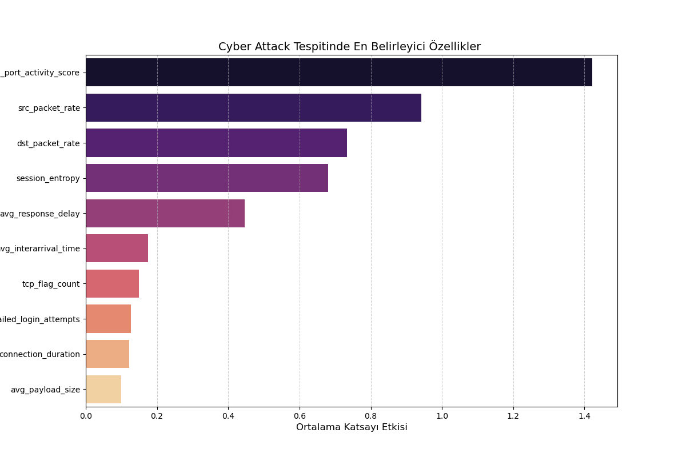
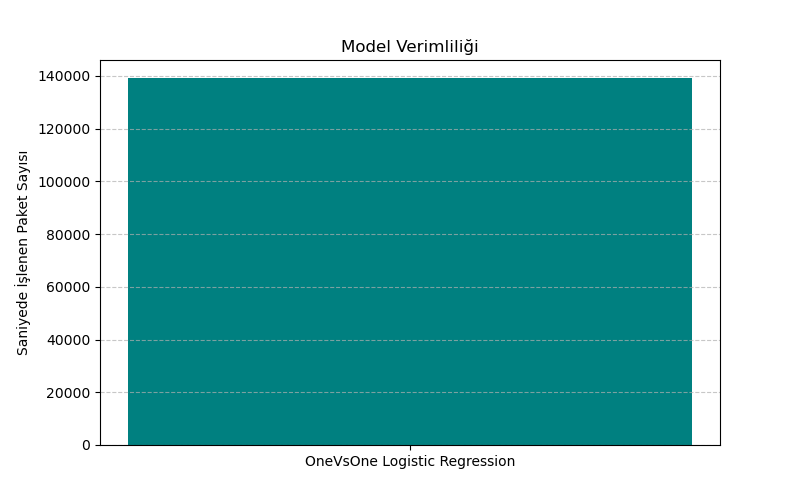

# 🛡️ Real-Time Cyber Attack Detection with Logistic Regression (OvO)

Bu proje, ağ trafiği verilerini analiz ederek siber saldırıları gerçek zamanlı olarak sınıflandıran bir makine öğrenmesi modelidir.

## 🚀 Öne Çıkan Özellikler
- **Model:** One-Vs-One (OvO) Logistic Regression.
- **Yüksek Hız:** Saniyede ~150.000 paket işleme kapasitesi .
- **Detaylı Analiz:** Özellik önemi (Feature Importance) ve hata analizi (Error Analysis) yapılmıştır.

## 📊 Performans Özeti
Modelin eğitim ve test sonuçları:
- **Accuracy:** %79 
- **Hız:** 150,000 packets/sec.
- **Kritik Metrikler:** Port aktiviteleri ve paket hızları, saldırı tespitinde en belirleyici unsurlar olmuştur.

## 📈 Görselleştirmeler
Proje kapsamında üretilen temel analiz grafikleri:

### 1. Feature Importance (Özellik Önem Sıralaması)
Modelin karar verme sürecinde en etkili olan ağ özellikleri:

### 2. Model Throughput (Verimlilik)
Modelin saniyede işleyebildiği veri miktarı:

